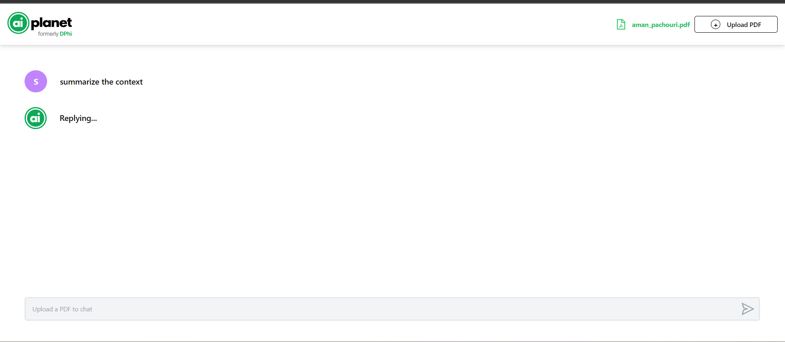
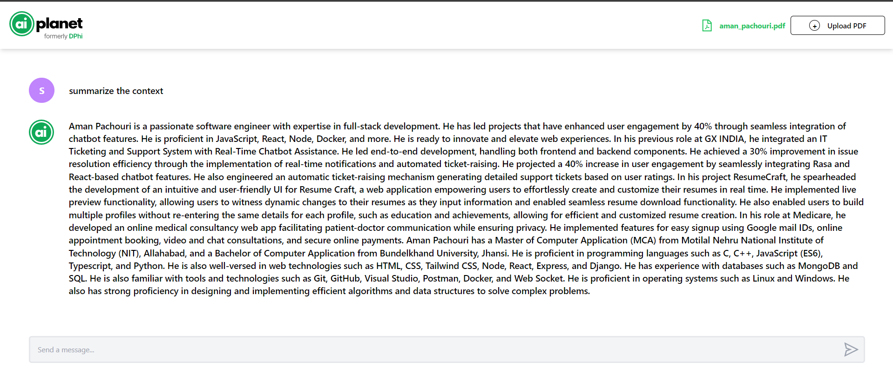

# Project README

## Project Setup

Follow these steps to set up the project.

1. **Install Dependencies:**

   ```js
   npm install
   ```

2. **Create env file:**

   ```js
   VITE_SERVER_URL= http://localhost:8000
   ```

3. **Run the Server:**
   ```py
   npm run dev
   ```

### Example Screenshots:

- 
- 

# Backend Repository Link:

`https://github.com/Impachouri/pdfbot-backend` .
